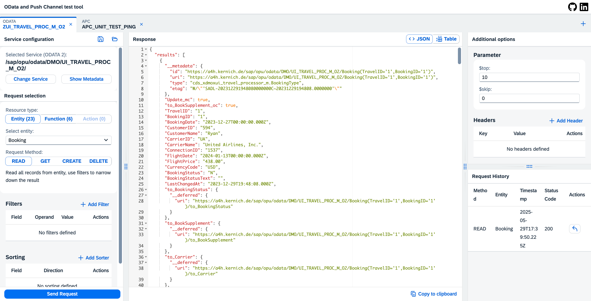
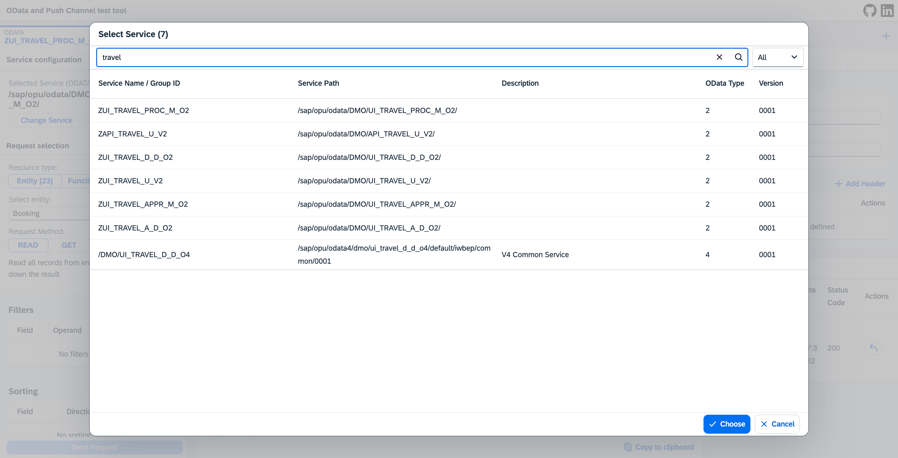
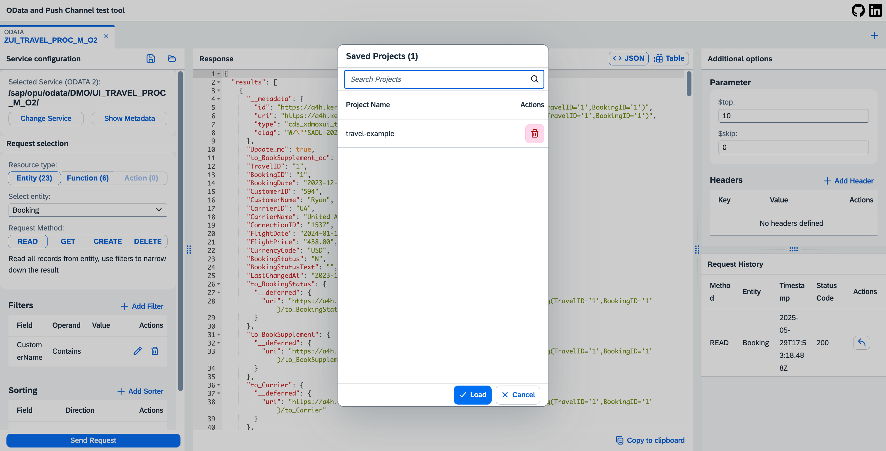

# ODAPU - OData & APC Test Tool

This app gives you a powerful tool to test ODATA services – whether it’s modern ABAP RAP/CDS or classic SEGW projects – as well as APC (ABAP Push Channels).
With its intuitive UI, you can easily build test cases, run them instantly, and save them for quick access later.
No more manual hassle – just click, test, repeat. ⚡

## 🔧 System Requirements
- At least one system with S/4HANA components
- Works both on-premise and in the SAP BTP (Cloud) environment

## Screenshot

