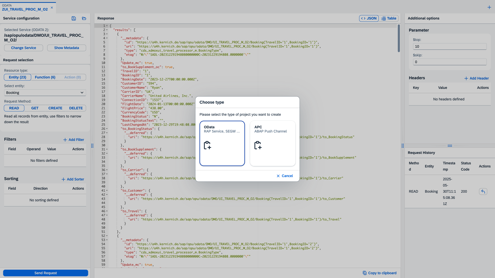

# OData & APC Test Tool

This app gives you a powerful tool to test ODATA services – whether it's modern ABAP RAP/CDS or classic SEGW projects – as well as APC (ABAP Push Channels).
With its intuitive UI, you can easily build test cases, run them instantly, and save them for quick access later.
No more manual hassle – just click, test, repeat. ⚡

## 🚀 Highlights

- **One Tool for everything:** ODATA and ABAP Push channel in one place. Whether using old or newer, modern technolgoies.
- **Parallel Testing:** Run multiple requests or channels simultaneously – perfect for complex debugging and real-time monitoring. Each project will be placed in it's own tab, which can be switched anytime.
- **ODATA Request builder:** Easily switch between entity (and CRUD operation), function and action to pick the right ressource you want to test. Based on the selection, you will see the right inputs to fill.
- **Extended ODATA entity functions:** Detailed and user friendly options to define filter, sorter, header, expand and general request options with no need of manual URL build.
- **ODATA Metadata visualization:** View metadata.xml contents and full visualization of OData project including entities, functions, actions and complex types
- **ODATA Requests history:** Recently used resources are saved for quick access to your latest requests
- **Project Management:** Save, load, and organize your test cases.
- **Service & Channel Search:** Quickly find OData services and Push Channels.
- **Flexible Data View:** Switch between different views to display data.
- **Success and Error sound feedback:** Audio notifications for successful operations and error states
- **Multilanguage Support:** English (en), German (de) - Deutsch, French (fr) - Français, Turkish (tr) - Türkçe, Spanish (es) - Español, Italian (it) - Italiano, Russian (ru) - Русский
- **Update notification:** Automatically notifies you when a new version is available

## 🔧 System Requirements
- At least one system with S/4HANA components
- Works both on-premise and in the SAP BTP (Cloud) environment

## Feature Showcase

Main screen of ODATA service testing.


Find and pick your service in seconds to get started — just search the list. 


Create requests with just a few clicks — straight from the available resources of the current ODATA service.


Switch from JSON data preview to table view mode. 


Quickly add or edit filter and sorter definitions by selecting properties from the chosen entity.


Save and load your projects. 


Work with ODATA and APC tools all in one place.


Pick any ABAP Push Channel which is available on the system.  Connect or disconnect the selected ABAP Push Channel. Write and Receive Messages.


Create and manage multiple ODATA and APC projects simultaneously — switch between them effortlessly.


## 📌 How to use

To set up and use this project, you need to use [abapgit](https://abapgit.org/). Follow these steps:

1. Install abapgit in your ABAP system.
2. Clone this repository using abapgit.
3. Follow the abapgit instructions to pull and activate the project.

For more details, visit the [abapgit documentation](https://docs.abapgit.org/).

### Import with abapgit failed with service binding / definition

If the abapgit import failed for `ZODPU_SRV` service definition or `ZODPU_O2` service binding, then you need to manually create them.

Create new service definition `ZODPU_SRV` with the following contents:
```ABAP
@EndUserText.label: 'ODATA & APC Test Tool: Main Service'
define service ZODPU_SRV {
  expose ZCE_ODPU_INFO as Info;
  expose ZCE_ODPU_SERVICES as ODataService;
  expose ZCE_ODPU_APC as PushChannel;
  expose ZC_ODPU_OPROJ as ODataServiceProject;
  expose ZCE_ODPU_TABLE as Dictionary;
  expose ZCE_ODPU_TABLE_FIELDS as DictionaryField;
}
```

Create new service binding `ZODPU_O2`


## OnPremise specific setup steps

1. Open transaction `/UI2/SEMOBJ` and create a new semantic object: `ZODPU`.
2. Open transaction `PFCG` and create a new role: `ZODPU`.  
   - Add the Launchpad Catalog `ZODPU` and Launchpad Group `ZODPU`.  
   - Assign the role to your user.
3. Open transaction `SICF` and ensure the service node `zodpu_ui5` is activated.
4. Launch the Fiori Launchpad via `/UI2/FLP` and start the `ODAPU` app.

## Cloud / SAP BTP specific setup steps

**Note:** This environment is actually not tested yet!

1. Deploy the UI5 application form here: https://github.com/mariokernich/odapu-ui5
2. Ensure service binding `ZODPU_O2` is published
3. Open the UI5 application from HTML5 applications section or add it to an SAP Work Zone launchpad. 

## License

This project is licensed under the Apache Software License, version 2.0 except as noted otherwise in the [LICENSE](LICENSE) file.
