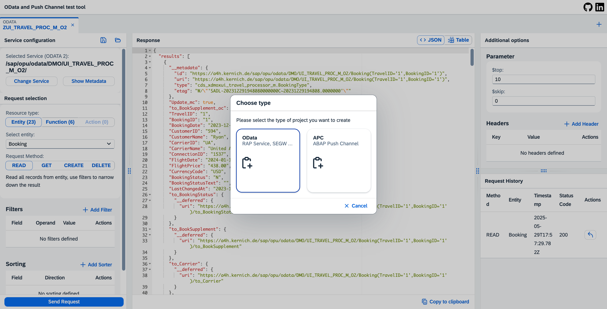

# ODAPU - OData & APC Test Tool

This app gives you a powerful tool to test ODATA services – whether it’s modern ABAP RAP/CDS or classic SEGW projects – as well as APC (ABAP Push Channels).
With its intuitive UI, you can easily build test cases, run them instantly, and save them for quick access later.
No more manual hassle – just click, test, repeat. ⚡

## 🚀 Highlights

- **One Tool for everything:** ODATA and ABAP Push channel in one place.
- **Parallel Testing:** Run multiple requests or channels simultaneously – perfect for complex debugging and real-time monitoring.
- **Project Management:** Save, load, and organize your test cases.
- **Service & Channel Search:** Quickly find OData services and Push Channels.
- **Flexible Data View:** Switch between different views to display data.

## 🔧 System Requirements
- At least one system with S/4HANA components
- Works both on-premise and in the SAP BTP (Cloud) environment

## Feature Showcase

Main screen of ODATA service testing.

Switch from JSON data preview to table view mode. 

Just search and your service from a list. 

Save and load your projects. 

Create parallel projects and test multiple resources at the same time. 

Pick any ABAP Push Channel which is available on the system.

Push channel main view. Connect or disconnect the selected ABAP Push Channel. Write and Receive Messages.

## 📌 How to use

To set up and use this project, you need to use abapgit. Follow these steps:

1. Install abapgit in your ABAP system.
2. Clone this repository using abapgit.
3. Follow the abapgit instructions to pull and activate the project.

For more details, visit the [abapgit documentation](https://docs.abapgit.org/).